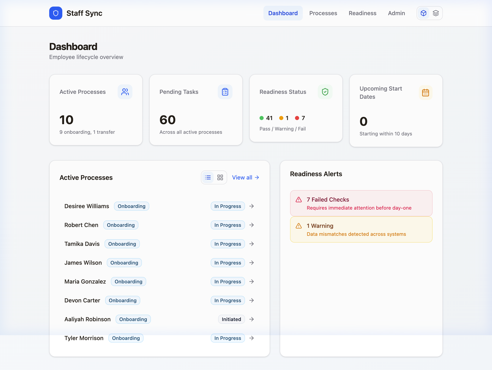

# Staff Sync

**Employee lifecycle visibility and validation for COTA HR**

Staff Sync gives COTA's HR, IT Service Desk, and hiring managers a unified view of employee onboarding, transfer, and offboarding processes. It tracks status across teams, auto-generates EIS/BOIS forms, and validates data consistency across disconnected systems before an employee's first day.

> **Status:** MVP complete (mockup with seeded data) · Vision planned (live integrations + admin)



---

## Key Features

| Feature | Description |
|---------|-------------|
| **Onboarding Tracker** | Per-employee and aggregate views of all active processes with task ownership, status, and timestamps |
| **Day-One Readiness** | Automated validation — names, emails, badge/ID, AD account status across systems (7 check types, pass/warning/fail) |
| **EIS/BOIS Forms** | Web-first form generation — HR enters data once, hiring manager completes Section 2 via link, service desk sees tracked task |
| **Email Sync Monitoring** | Cross-reference AD email vs Infor email, flag mismatches before start date |
| **Role-Based Access** | 6 roles with visibility matrix — HR, Service Desk, Hiring Manager, HRIS |
| **MVP/Vision Toggle** | Switch between MVP (read-only mockup) and Vision (full CRUD) modes |

---

## Tech Stack

| Layer | Technology |
|-------|-----------|
| Frontend | React 19 · Vite 7 · TailwindCSS v4 · shadcn/ui · wouter |
| Backend | Express · tRPC · Drizzle ORM · SQLite |
| Design | oklch design tokens · InterVariable font · blue-600 accent |
| Infrastructure | Docker · Node.js 22 LTS |

---

## Quick Start

### Docker

```bash
git clone https://github.com/dcharb-darwin/staff-sync.git
cd staff-sync
docker compose up --build -d
open http://localhost:3000
```

### Local Development

```bash
git clone https://github.com/dcharb-darwin/staff-sync.git
cd staff-sync
npm install
npm run dev
open http://localhost:3000
```

Database seeds automatically on first run (6 users, 14 employees, realistic validation scenarios).

---

## Documentation

| Document | Description |
|----------|-------------|
| [MVP PRD](docs/MVP_PRD.md) | Run 1 requirements — process flows, user stories, RBAC, screenshots |
| [Vision PRD](docs/VISION_PRD.md) | Run 2 scope — live integrations, admin CRUD, automation, roadmap |
| [Data Model](docs/DATA_MODEL.md) | Schema reference — 8 tables, ER diagram, PII classification, enum values |
| [Walkthrough](docs/WALKTHROUGH.md) | Developer guide — setup, routes, agent pipeline, seed data, QA evidence |
| [Business PRD](PRD.MD) | Full business requirements from discovery (640 lines) |

---

## Architecture

```
server/
├── _core/index.ts       ← Express + tRPC + Vite (port 3000)
├── db/schema.ts          ← 8 tables (Drizzle ORM)
├── db/seed.ts            ← Mock data seeder
└── routers.ts            ← tRPC API routers

client/src/
├── pages/                ← Dashboard, Processes, ProcessDetail, EISForm, Readiness, Admin
├── components/           ← AppLayout, ViewToggle, 18 shadcn/ui primitives
└── lib/                  ← tRPC client, badge styles, utils
```

---

## Client

**Central Ohio Transit Authority (COTA)** · Columbus, Ohio
Built by **Darwin Customer Solutions**

---

## License

Proprietary — Darwin Customer Solutions © 2026
