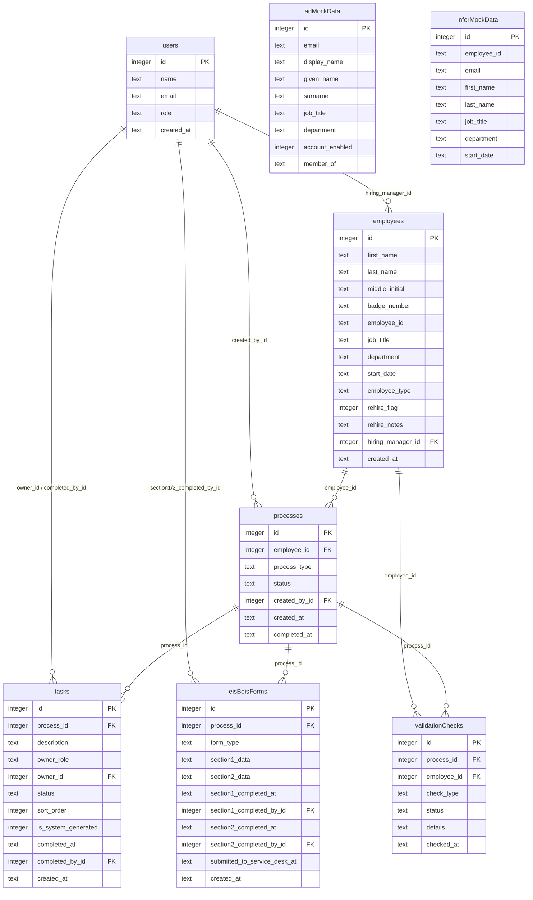

# Staff Sync — Data Model Reference

> Source of truth: [`server/db/schema.ts`](../server/db/schema.ts) · Types: [`shared/types.ts`](../shared/types.ts)

Staff Sync uses an 8-table SQLite schema managed by Drizzle ORM. The schema models employee lifecycle processes (onboarding, transfer, offboarding) as a polymorphic `processes` table linked to ordered `tasks`, EIS/BOIS web forms, and day-one readiness validation checks. Two mock tables (`adMockData`, `inforMockData`) simulate external system data for MVP.

---

## Entity-Relationship Diagram



---

## Table Definitions

### `users`

Staff Sync system users — stakeholders who interact with the application.

| Field | Type | Constraints | Description |
|-------|------|-------------|-------------|
| `id` | integer | PK, auto-increment | Unique user ID |
| `name` | text | NOT NULL | Full display name |
| `email` | text | NOT NULL | Work email address |
| `role` | text | NOT NULL | One of 6 roles (see Enum Values) |
| `created_at` | text | DEFAULT CURRENT_TIMESTAMP | ISO timestamp |

### `employees`

Employee records tracked through lifecycle processes. Contains **non-sensitive data only** (PRD §3.2).

| Field | Type | Constraints | Description |
|-------|------|-------------|-------------|
| `id` | integer | PK, auto-increment | Unique employee ID |
| `first_name` | text | NOT NULL | Legal first name |
| `middle_initial` | text | nullable | Middle initial |
| `last_name` | text | NOT NULL | Legal last name |
| `badge_number` | text | nullable | COTA badge number (format: `B-YYYY-NNNN`) |
| `employee_id` | text | nullable | HR employee ID (format: `EMP-YYYYMMDD-NNN`) |
| `job_title` | text | nullable | Position title |
| `department` | text | nullable | Department name |
| `start_date` | text | nullable | ISO date string |
| `employee_type` | text | NOT NULL, DEFAULT `bus_operator` | `bus_operator` or `admin` |
| `rehire_flag` | integer | DEFAULT 0 | 1 = rehire, 0 = new hire |
| `rehire_notes` | text | nullable | Prior employment details, old badge/ID |
| `hiring_manager_id` | integer | FK → `users.id`, nullable | Assigned hiring manager |
| `created_at` | text | DEFAULT CURRENT_TIMESTAMP | ISO timestamp |

### `processes`

Polymorphic lifecycle processes — onboarding, transfer, or offboarding.

| Field | Type | Constraints | Description |
|-------|------|-------------|-------------|
| `id` | integer | PK, auto-increment | Unique process ID |
| `employee_id` | integer | NOT NULL, FK → `employees.id` | Subject employee |
| `process_type` | text | NOT NULL | `onboarding`, `transfer`, or `offboarding` |
| `status` | text | NOT NULL, DEFAULT `initiated` | Current status (see Enum Values) |
| `created_by_id` | integer | FK → `users.id`, nullable | User who initiated |
| `created_at` | text | DEFAULT CURRENT_TIMESTAMP | ISO timestamp |
| `completed_at` | text | nullable | ISO timestamp when completed |

### `tasks`

Ordered checklist items within a process. Derived from PRD §2.7 task definitions.

| Field | Type | Constraints | Description |
|-------|------|-------------|-------------|
| `id` | integer | PK, auto-increment | Unique task ID |
| `process_id` | integer | NOT NULL, FK → `processes.id` | Parent process |
| `description` | text | NOT NULL | Human-readable task description |
| `owner_role` | text | NOT NULL | Role responsible (e.g., `hr_generalist`) |
| `owner_id` | integer | FK → `users.id`, nullable | Assigned user |
| `status` | text | NOT NULL, DEFAULT `pending` | Task status (see Enum Values) |
| `sort_order` | integer | NOT NULL | Step sequence number (1-based) |
| `is_system_generated` | integer | DEFAULT 0 | 1 = auto-created, 0 = manual |
| `completed_at` | text | nullable | ISO timestamp |
| `completed_by_id` | integer | FK → `users.id`, nullable | User who completed |
| `created_at` | text | DEFAULT CURRENT_TIMESTAMP | ISO timestamp |

### `eisBoisForms`

EIS (Employee Information Sheet) / BOIS (Bus Operator Information Sheet) web forms. Section 1 = HR data entry, Section 2 = hiring manager completion.

| Field | Type | Constraints | Description |
|-------|------|-------------|-------------|
| `id` | integer | PK, auto-increment | Unique form ID |
| `process_id` | integer | NOT NULL, FK → `processes.id` | Parent onboarding process |
| `form_type` | text | NOT NULL | `eis` or `bois` |
| `section1_data` | text | nullable | JSON — HR-entered employee data |
| `section2_data` | text | nullable | JSON — hiring manager equipment/access data |
| `section1_completed_at` | text | nullable | ISO timestamp |
| `section1_completed_by_id` | integer | FK → `users.id`, nullable | HR user who completed |
| `section2_completed_at` | text | nullable | ISO timestamp |
| `section2_completed_by_id` | integer | FK → `users.id`, nullable | Hiring manager who completed |
| `submitted_to_service_desk_at` | text | nullable | ISO timestamp of service desk submission |
| `created_at` | text | DEFAULT CURRENT_TIMESTAMP | ISO timestamp |

### `validationChecks`

Day-one readiness validation results (PRD §2.8). Each check returns pass/warning/fail.

| Field | Type | Constraints | Description |
|-------|------|-------------|-------------|
| `id` | integer | PK, auto-increment | Unique check ID |
| `process_id` | integer | NOT NULL, FK → `processes.id` | Parent process |
| `employee_id` | integer | NOT NULL, FK → `employees.id` | Subject employee |
| `check_type` | text | NOT NULL | Validation type (see Enum Values) |
| `status` | text | NOT NULL | `pass`, `warning`, or `fail` |
| `details` | text | nullable | JSON — source-specific validation details |
| `checked_at` | text | DEFAULT CURRENT_TIMESTAMP | ISO timestamp |

### `adMockData`

Simulated Active Directory data for MVP mockup. Replaces live AD/Graph API integration.

| Field | Type | Constraints | Description |
|-------|------|-------------|-------------|
| `id` | integer | PK, auto-increment | Unique record ID |
| `email` | text | NOT NULL | `userPrincipalName` equivalent |
| `display_name` | text | NOT NULL | AD display name |
| `given_name` | text | nullable | First name |
| `surname` | text | nullable | Last name |
| `job_title` | text | nullable | Position |
| `department` | text | nullable | Department |
| `account_enabled` | integer | DEFAULT 1 | 1 = active, 0 = disabled |
| `member_of` | text | nullable | JSON array of AD group names |

### `inforMockData`

Simulated Infor HRIS data for MVP mockup. Replaces live Infor API integration.

| Field | Type | Constraints | Description |
|-------|------|-------------|-------------|
| `id` | integer | PK, auto-increment | Unique record ID |
| `employee_id` | text | NOT NULL | Infor employee ID |
| `email` | text | NOT NULL | Infor email address |
| `first_name` | text | NOT NULL | First name |
| `last_name` | text | NOT NULL | Last name |
| `job_title` | text | nullable | Position |
| `department` | text | nullable | Department |
| `start_date` | text | nullable | ISO date string |

---

## Enum Values

All enums defined in [`shared/types.ts`](../shared/types.ts):

| Type | Values | Usage |
|------|--------|-------|
| `ProcessType` | `onboarding`, `transfer`, `offboarding` | `processes.process_type` |
| `ProcessStatus` | `initiated`, `in_progress`, `pending_review`, `completed` | `processes.status` |
| `TaskStatus` | `pending`, `in_progress`, `completed`, `skipped` | `tasks.status` |
| `UserRole` | `hr_generalist`, `hr_manager`, `service_desk_analyst`, `service_desk_manager`, `hiring_manager`, `hris_analyst` | `users.role` |
| `EmployeeType` | `bus_operator`, `admin` | `employees.employee_type` |
| `FormType` | `eis`, `bois` | `eisBoisForms.form_type` |
| `ValidationCheckType` | `ad_account_exists`, `name_consistency`, `email_match`, `badge_id_reconciliation`, `form_complete`, `service_desk_provisioning`, `non_ad_systems` | `validationChecks.check_type` |
| `ValidationStatus` | `pass`, `warning`, `fail` | `validationChecks.status` |

---

## JSON Field Schemas

### `section1_data` (HR-entered employee information)

```json
{
  "employeeName": "Marcus Johnson",
  "badgeNumber": "B-2026-0441",
  "employeeId": "EMP-20260317-001",
  "jobTitle": "Bus Operator",
  "department": "Transit Operations",
  "startDate": "2026-03-17",
  "employeeType": "bus_operator",
  "workLocation": "COTA Main Campus",
  "supervisorName": "Transit Operations Supervisor"
}
```

### `section2_data` (Hiring manager equipment/access)

```json
{
  "equipmentNeeded": ["uniform", "badge_holder", "radio"],
  "systemAccess": ["scheduling_system", "training_portal", "email"],
  "workStation": "Bus Yard A",
  "trainingSchedule": "Week 1: Classroom, Week 2: On-Route",
  "specialInstructions": "",
  "managerApproval": true,
  "approvalDate": "2026-03-01"
}
```

### `details` (Validation check results — varies by check type)

```json
// ad_account_exists
{ "message": "AD account found", "email": "mjohnson@cota.com" }

// name_consistency (warning)
{ "expected": "Desiree Williams", "adDisplayName": "Desi Williams",
  "message": "AD display name differs from legal name" }

// email_match (fail)
{ "adEmail": "mgonzalez@cota.com", "inforEmail": "maria.gonzalez@cota.com",
  "message": "AD email does not match Infor email" }

// badge_id_reconciliation (fail — rehire)
{ "currentBadge": "B-2026-0447", "previousBadge": "B-2023-0198",
  "message": "Rehire badge does not match previous badge on file" }
```

---

## PII Classification

Per PRD §3.2, Staff Sync enforces strict data boundaries:

| Classification | Fields Stored | Access |
|----------------|--------------|--------|
| **Non-Sensitive** | Name, badge number, employee ID, job title, department, start date, email, process status, task ownership, AD group names | All authorized users (role-filtered) |
| **Restricted Non-Sensitive** | Employee type, rehire status/notes, EIS/BOIS full form content, badge/ID mismatch notes | HR roles only |
| **Never Stored** | SSN, home address, DOB, bank/payroll info, compensation/salary, benefits, emergency contacts | ❌ No mechanism to ingest |

> Staff Sync has no fields, columns, or ingestion paths for sensitive PII. The personal data form (Adobe PDF) remains entirely outside Staff Sync's boundary.

---

## Task Templates

Tasks are seeded from templates per process type (defined in `seed.ts`):

**Onboarding (10 tasks):** Initiate → Complete Section 1 → Assign hiring manager → Complete Section 2 → Submit to Service Desk → Create AD account → Provision systems → Validate readiness → Confirm badge/ID → Close process

**Transfer (7 tasks):** Initiate → Update record → Submit notification → Update AD groups → Update system access → Validate completion → Close process

**Offboarding (6 tasks):** Initiate → Submit BOIS → Disable AD account → Revoke access → Confirm equipment return → Close process
