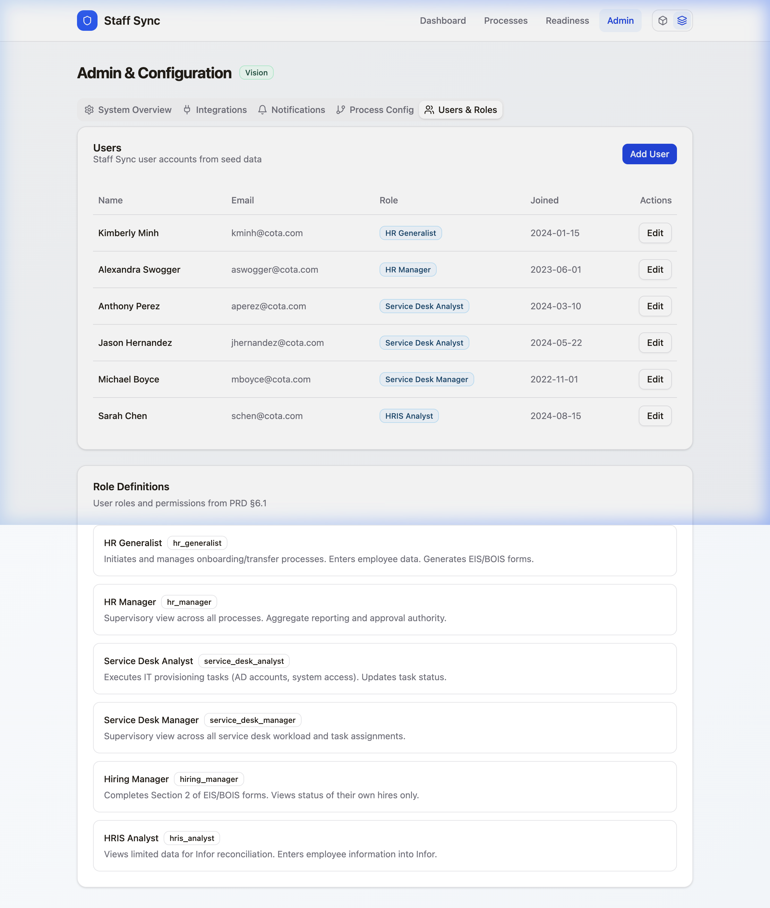
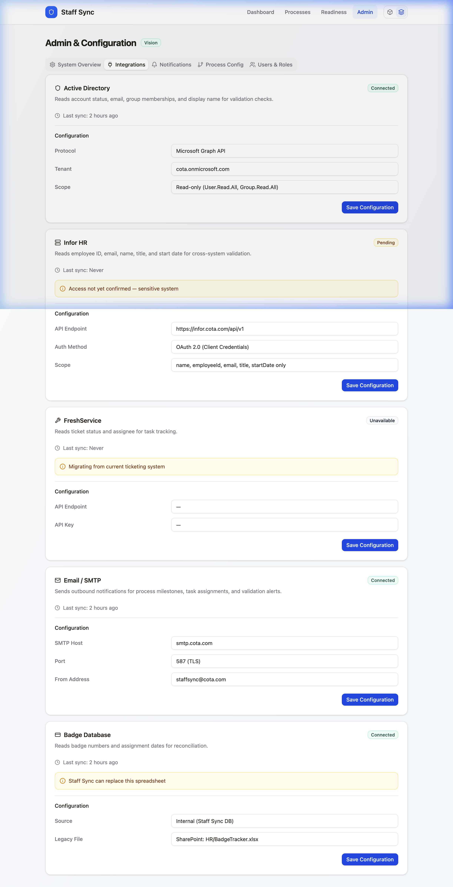

# Staff Sync — Vision Product Requirements (Run 2)

**Product:** Staff Sync · **Client:** COTA · **Status:** Planned · **Date:** March 2026

> **Run 2 (Vision)** builds on the MVP mockup with live integrations, full admin configuration, automation features, and production deployment. See [MVP_PRD.md](MVP_PRD.md) for Run 1 scope.

---

## 1. Vision Scope Overview

| Dimension | MVP (Run 1) | Vision (Run 2) |
|-----------|-------------|----------------|
| Data | Seeded mock data in SQLite | Live integrations (AD, Infor, ticketing) |
| Admin | Read-only config display with `[MVP]` badge | Full CRUD — users, integrations, forms, notifications |
| Validation | Pre-computed mock validation results | Real-time cross-system validation engine |
| Forms | Static web forms with mock data | Dynamic EIS/BOIS with email notifications |
| Auth | No authentication | SSO via Azure AD / Entra ID |
| Deployment | Local Docker dev | Production Azure hosting |

---

## 2. Live Integrations

### 2.1 Active Directory — Microsoft Graph API

**Status:** ✅ Access confirmed

| Endpoint | Data | Usage |
|----------|------|-------|
| `GET /users/{upn}` | `displayName`, `givenName`, `surname`, `userPrincipalName`, `jobTitle`, `department`, `accountEnabled` | Account existence, name validation, email match |
| `GET /users/{upn}/memberOf` | Group membership list | Transfer membership diff, over-provisioning detection |

**Frequency:** On-demand per employee + nightly batch for readiness (all employees with start dates in next 5 business days).

### 2.2 Infor HRIS — Scoped Read-Only API

**Status:** ⚠️ TBD — Access may not be granted (OQ-1)

**Requested scope (non-sensitive only):**
- Employee name (first, middle, last)
- Employee ID
- Email address
- Job title, department, start date

**Fallback if denied:**
- Option A: Scheduled CSV export from HRIS team
- Option B: HRIS manual confirmation in Staff Sync
- Option C: Email validation deferred; AD-only data

### 2.3 FreshService Ticketing

**Status:** ⚠️ TBD — current system may lack API; FreshService (future) will have it (OQ-3)

| Data | Usage |
|------|-------|
| Ticket ID, status, assignee, timestamps | Auto-update task status when tickets are closed |
| Forked ticket references | Track non-AD provisioning completion |

**Fallback:** Service desk manually updates task status in Staff Sync (~30 sec per update).

### 2.4 Azure AD / Entra ID — Session & MFA

**Status:** ⚠️ TBD (OQ-4)

| Data | Usage |
|------|-------|
| Session status | Offboarding: confirm sessions terminated |
| MFA status | Offboarding: confirm MFA revoked |

**Fallback:** Service desk confirms via manual checkbox in Staff Sync.

---

## 3. Admin Configuration (Full CRUD)

### 3.1 User Management

- Add/edit/deactivate Staff Sync users
- Assign roles from 6 defined roles (PRD §6.1)
- View audit trail of user actions

### 3.2 Integration Settings

- AD connection: Graph API endpoint, tenant ID, client credentials
- Infor connection: API endpoint, auth token, field mapping
- SMTP: server, port, from address, credentials
- Ticketing: FreshService API key, webhook URL

### 3.3 Form Template Management

- Customize EIS/BOIS Section 1 and Section 2 field lists
- Add/remove equipment options, system access selections
- Configure department-specific form variants

### 3.4 Notification Rules

Configure triggers from PRD §4.4:

| Trigger | Default Recipients | Channel |
|---------|-------------------|---------|
| Process initiated | Hiring Manager, Service Desk | Email |
| Task assigned | Task owner | Email |
| Validation failure | HR Generalist, Process owner | Email |
| Readiness all-clear | HR Generalist, Hiring Manager | Email |
| Process completed | All stakeholders | Email |

### 3.5 Audit Logging

- All user actions logged: who, what, when
- Process state transitions with timestamps
- Validation check history (pass/warning/fail over time)
- Data export for compliance reporting

---

## 4. Advanced Features

### 4.1 Bulk Class Onboarding

Bus operator classes of 15–30 are onboarded simultaneously. Vision adds:
- **Class creation:** Group employees into a named class with shared start date
- **Batch operations:** Run readiness checks, generate forms, assign tasks across entire class
- **Class dashboard:** Aggregate progress view (per PRD user story US-16)

### 4.2 Transfer Membership Diff Automation

Per PRD §2.3, transfers require comparing current vs target AD group memberships:
- **Side-by-side display:** Current groups ↔ target groups (from profile-to-copy)
- **Auto-generated checklist:** Groups to remove (red), groups to add (green), groups to keep (neutral)
- **Confirmation workflow:** Analyst marks each group change as completed
- **Timing aware:** Flags if changes not applied before effective date

### 4.3 Scheduled Readiness Reports

Per PRD §2.8:
- **Nightly batch:** Auto-run for all employees with start dates in next 5 business days
- **Email digest:** Summary of who's ready, who has warnings, who has failures
- **On-demand:** HR can trigger for any individual or class
- **Historical tracking:** Readiness status over time (trending toward ready)

### 4.4 Analytics Dashboard

- Process completion times by type (onboarding/transfer/offboarding)
- Bottleneck identification — which tasks take longest, which roles are overloaded
- Volume trends — hires per month, class sizes, transfer frequency
- Error rates — validation failure frequency by check type

---

## 5. Notification Engine

### Email Templates

Each trigger generates a branded email:
- **Subject format:** `[Staff Sync] {Employee Name} — {Action}`
- **Body:** Relevant details + direct link to Staff Sync page
- **Branding:** COTA logo, Darwin footer

### SMTP Configuration

Configurable via Admin (§3.2):
- Support for COTA's internal SMTP relay
- TLS/SSL support
- From address and reply-to configuration

### Webhook Support (Future)

- Outbound webhooks for integration with Microsoft Teams / Slack
- Payload format matches tRPC response schemas

---

## 6. Deployment & Authentication

### Production Docker

- Multi-stage Dockerfile (build + production)
- Azure Container Instances or Azure App Service
- SQLite → PostgreSQL migration for production scale
- Health check endpoint for monitoring

### SSO — Azure AD / Entra ID

Per PRD assumption A3:
- OIDC/OAuth2 flow via Azure AD
- Role mapping: Azure AD groups → Staff Sync roles
- Session management: JWT tokens with refresh
- No separate credential management

---

## 7. Roadmap

### Phase 2a — Integrations + Admin CRUD

**Dependencies:** OQ-1 (Infor access), OQ-7 (SSO)

- Live AD integration via Graph API
- Admin user management (full CRUD)
- Admin integration settings UI
- SSO authentication

### Phase 2b — Automation + Analytics

**Dependencies:** OQ-3 (ticketing API), OQ-9 (platform timelines)

- Scheduled readiness reports (nightly batch)
- Bulk class onboarding
- Transfer membership diff with auto-checklist
- Analytics dashboard
- Notification engine with email templates

### Phase 2c — Deployment + Production

**Dependencies:** OQ-8 (data residency), all integration access confirmed

- Production Docker build
- Azure hosting deployment
- PostgreSQL migration
- Performance optimization
- Security audit

### Open Question Dependency Gates

| OQ | Blocks | Decision Point |
|----|--------|----------------|
| OQ-1 (Infor access) | Phase 2a — email validation | Before integration development |
| OQ-3 (Ticketing API) | Phase 2b — auto task tracking | Before automation development |
| OQ-5 (Hiring manager adoption) | Phase 2b — form workflow | Before notification engine |
| OQ-7 (SSO) | Phase 2a — authentication | Before deployment |
| OQ-8 (Data residency) | Phase 2c — hosting | Before production deployment |
| OQ-9 (Platform timelines) | Phase 2b scope | Determines build-vs-wait for status tracking |
