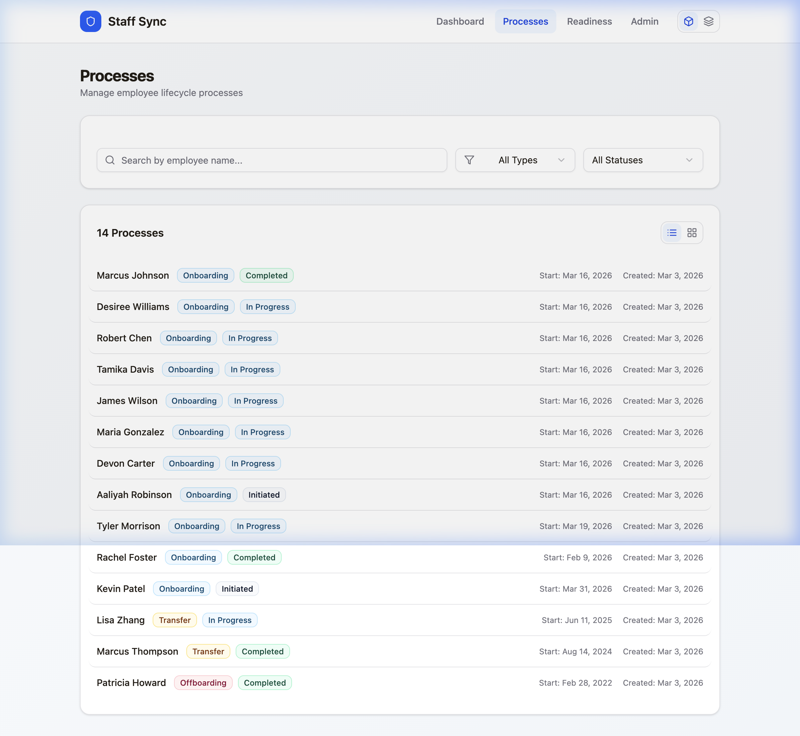
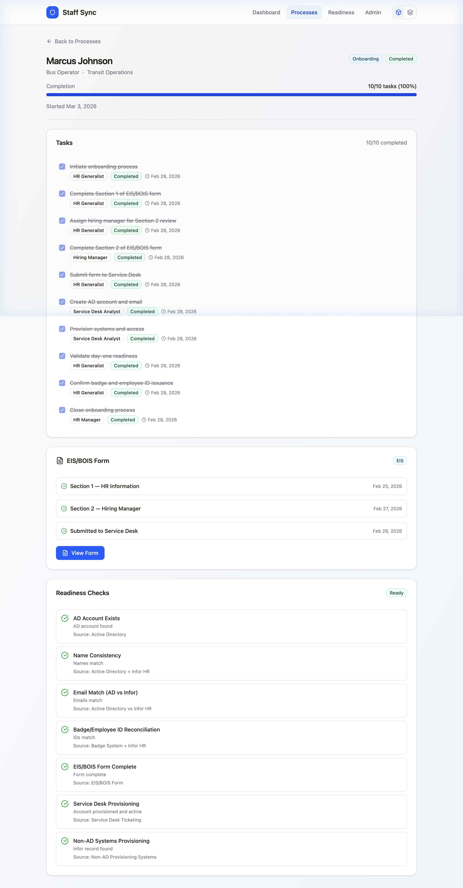
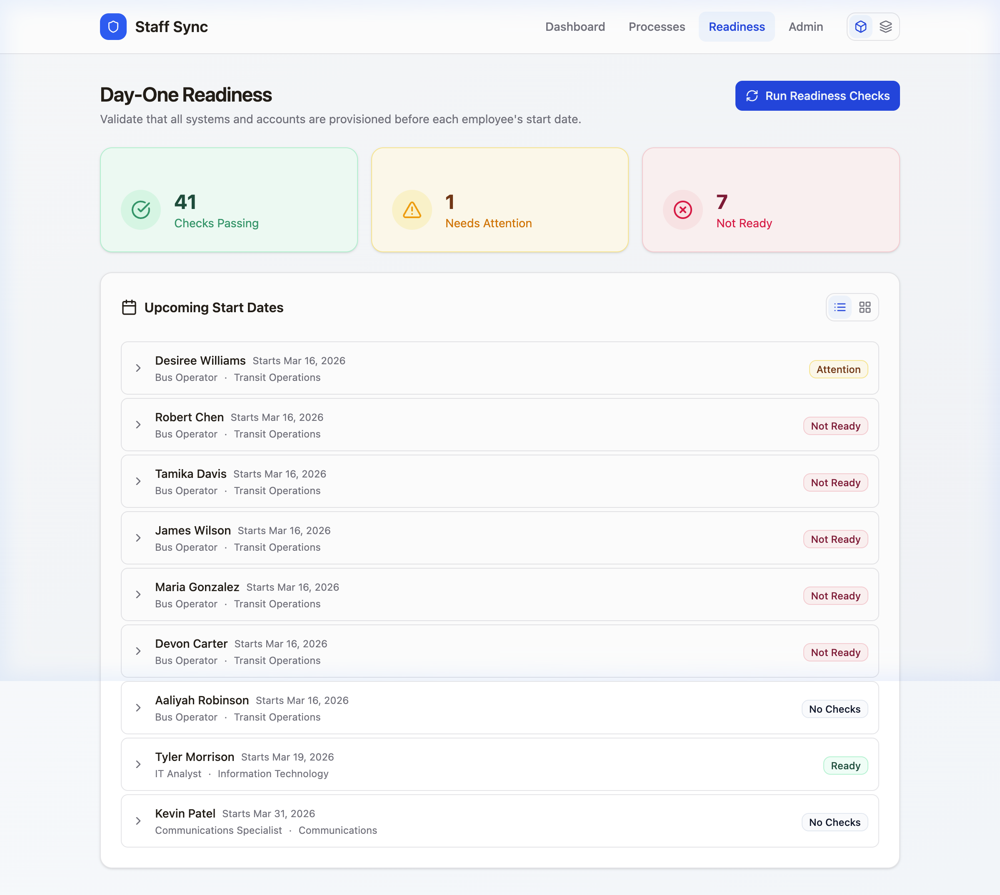
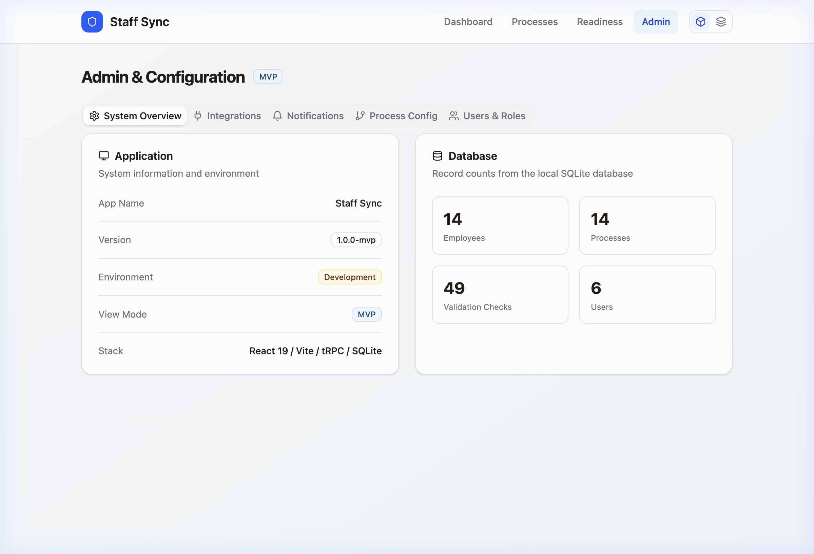
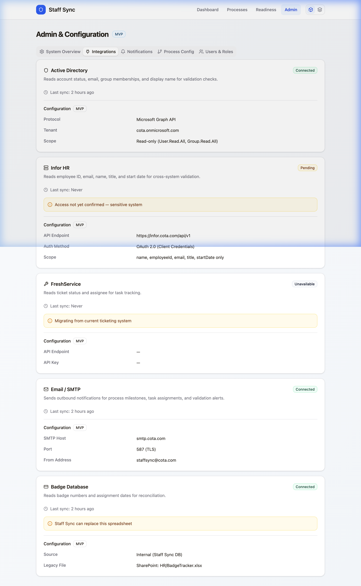

# Staff Sync — Developer Walkthrough

> Developer guide, architecture reference, and QA evidence for Staff Sync.

---

## Quick Start

### Docker (recommended for QA)

```bash
cd /path/to/staff-sync
docker compose up --build -d    # Build and start on port 3000
docker compose logs --tail 10   # Check logs
open http://localhost:3000       # Open in browser
docker compose down              # Stop
```

### Local Development

```bash
cd /path/to/staff-sync
npm install                      # Install dependencies
npm run dev                      # Start dev server on port 3000
open http://localhost:3000       # Open in browser
```

### Verify Build

```bash
npm run check                    # TypeScript type-check
npm run build                    # Production build
npm run verify                   # Both (check + build)
```

---

## Tech Stack

| Layer | Technology | Version |
|-------|-----------|---------|
| Runtime | Node.js | 22 LTS |
| Framework | React | ~19.2 |
| Bundler | Vite | ~7.1 |
| Router | wouter | ~3.3 |
| API | tRPC | ~11.6 |
| Query | @tanstack/react-query | ~5.90 |
| ORM | Drizzle | ~0.44 |
| DB | SQLite (better-sqlite3) | — |
| CSS | TailwindCSS | v4 |
| Components | shadcn/ui (Radix primitives) | — |
| Icons | lucide-react | — |
| Validation | Zod | ~4.1 |
| Server | Express | ~4.21 |

---

## Architecture

```
staff-sync/
├── AGENTS.md                    ← Orchestrator guardrails
├── CLAUDE.md                    ← Claude Code worker context
├── codex-instructions.md        ← Codex CLI worker context
├── PRD.MD                       ← Business requirements (MVP)
├── Dockerfile / docker-compose.yml
├── package.json / vite.config.ts / tsconfig.json / drizzle.config.ts
│
├── agents/
│   ├── darwin-standards.md      ← Cross-project standards
│   ├── standards.md             ← Project pitfalls P1-P10 + design D1-D3
│   ├── lessons.md               ← Append-only learnings
│   └── sessions.md              ← Session log
│
├── .agents/workflows/
│   ├── launchpad.md             ← Phase checklist
│   ├── dispatch.md              ← Agent dispatch protocol
│   ├── qa.md                    ← Docker + browser QA
│   └── post-qa-docs.md          ← Documentation update workflow
│
├── docs/
│   ├── DATA_MODEL.md            ← Schema reference + ER diagram
│   ├── MVP_PRD.md               ← Run 1 requirements
│   ├── VISION_PRD.md            ← Run 2 requirements
│   ├── WALKTHROUGH.md           ← This file
│   └── screenshots/             ← App screenshots (MVP + Vision)
│
├── server/
│   ├── _core/index.ts           ← Express + tRPC + Vite dev middleware
│   ├── db/
│   │   ├── schema.ts            ← Drizzle ORM — 8 tables
│   │   ├── index.ts             ← DB connection (better-sqlite3, WAL mode)
│   │   └── seed.ts              ← Mock data seeder
│   └── routers.ts               ← tRPC routers
│
├── client/src/
│   ├── main.tsx, App.tsx, index.css
│   ├── contexts/                ← ViewModeContext, ThemeContext
│   ├── hooks/, lib/             ← trpc, utils, badge-styles
│   ├── components/
│   │   ├── AppLayout.tsx        ← App shell — sticky header, nav
│   │   ├── ViewToggle.tsx       ← Card/list toggle (controlled)
│   │   └── ui/                  ← 18 shadcn/ui primitives
│   └── pages/                   ← 6 pages (see Route Map)
│
└── shared/types.ts              ← Type definitions + label maps
```

---

## Route Map

| Path | Component | Description |
|------|-----------|-------------|
| `/` | `Dashboard.tsx` | KPI cards, active processes summary, readiness overview |
| `/processes` | `Processes.tsx` | List of all processes with status badges, filters, card/list toggle |
| `/process/:id` | `ProcessDetail.tsx` | Task checklist, form status, employee info, validation results |
| `/eis-form/:processId` | `EISForm.tsx` | EIS/BOIS web form — Section 1 (HR) + Section 2 (hiring manager) |
| `/readiness` | `Readiness.tsx` | Day-one readiness grid — per-employee validation results |
| `/admin` | `AdminSettings.tsx` | Admin configuration — read-only in MVP, full CRUD in Vision |

---

## Agent Pipeline

Staff Sync uses a multi-agent development workflow:

```
┌─────────────────────────────────────────────────────────┐
│  AGENTS.md (Orchestrator)                               │
│  ├── Reads: agents/darwin-standards.md (cross-project)  │
│  ├── Reads: agents/standards.md (P1-P10, D1-D3)        │
│  ├── Dispatches to:                                     │
│  │   ├── Claude Code (reads CLAUDE.md)                  │
│  │   └── Codex CLI (reads codex-instructions.md)        │
│  └── QA via: browser_subagent (Docker + Playwright)     │
└─────────────────────────────────────────────────────────┘
```

**Read order for workers:** `agents/darwin-standards.md` → `agents/standards.md` → `PRD.MD` → `CLAUDE.md` or `codex-instructions.md`

**Key pitfalls (P1-P10):** Always `await` Drizzle ops · Light theme default · Nav structure locked · Badge contrast · No PII · No worker file conflicts · Vite configFile in Docker · Docker required for QA · No trailing slash on Vite alias · Controlled component props

**Design principles (D1-D3):** Universal drill-down + source provenance · Card/list toggle everywhere · Visual parity across Darwin projects

---

## Seed Data

The database seeds automatically on first run (`server/db/seed.ts`):

### Users (6)

| Name | Role | Email |
|------|------|-------|
| Kimberly Minh | HR Generalist | kminh@cota.com |
| Alexandra Swogger | HR Manager | aswogger@cota.com |
| Anthony Perez | Service Desk Analyst | aperez@cota.com |
| Jason Hernandez | Service Desk Analyst | jhernandez@cota.com |
| Michael Boyce | Service Desk Manager | mboyce@cota.com |
| Sarah Chen | HRIS Analyst | schen@cota.com |

### Employees (14)

- **8 bus operators** — class starting 2026-03-17 (Marcus Johnson, Desiree Williams, Robert Chen, Tamika Davis, James Wilson, Maria Gonzalez, Devon Carter [rehire], Aaliyah Robinson)
- **3 admin hires** — Tyler Morrison (IT), Rachel Foster (Finance, completed), Kevin Patel (Comms, initiated)
- **2 transfers** — Lisa Zhang (in progress), Marcus T. Thompson (completed)
- **1 offboarding** — Patricia Howard (completed)

### Realistic Failure Scenarios

| Employee | Validation Issue | Type |
|----------|-----------------|------|
| Desiree Williams | AD displayName "Desi" vs legal "Desiree" | Warning |
| Robert Chen | Goes by "Bob" — preferred name policy question | Fail |
| Tamika Davis | No AD account found | Fail |
| James Wilson | EIS Section 2 not completed by hiring manager | Fail |
| Maria Gonzalez | AD email ≠ Infor email (mgonzalez vs maria.gonzalez) | Fail |
| Devon Carter | Rehire: badge mismatch + AD account disabled | Fail |

---

## Build History

**Session 1 — MVP Mockup Build (2026-03-02)**
- 48 files, 12,247 lines
- 5 initial pages + AdminSettings added later
- 18 shadcn/ui components + oklch design system
- Docker support with single-port Express + Vite dev middleware
- 2 commits pushed to `dcharb-darwin/staff-sync` main

See `agents/sessions.md` for full session log and `agents/lessons.md` for recorded pitfalls.

---

## MVP vs Vision Mode

Staff Sync implements the Darwin `ViewModeContext` toggle:

```tsx
type ViewMode = "mvp" | "vision";
// Default: "mvp" — persisted in localStorage
// Toggle: visible in app header
```

| Feature | MVP Mode | Vision Mode |
|---------|----------|-------------|
| Admin page | Read-only tables, `[MVP]` badge | Full CRUD forms, mutation endpoints |
| Routes | 6 core pages | + advanced admin routes |
| Data | Seeded mock data | Live integrations (planned) |

---

## QA Evidence

### MVP Mode












### Vision Mode


